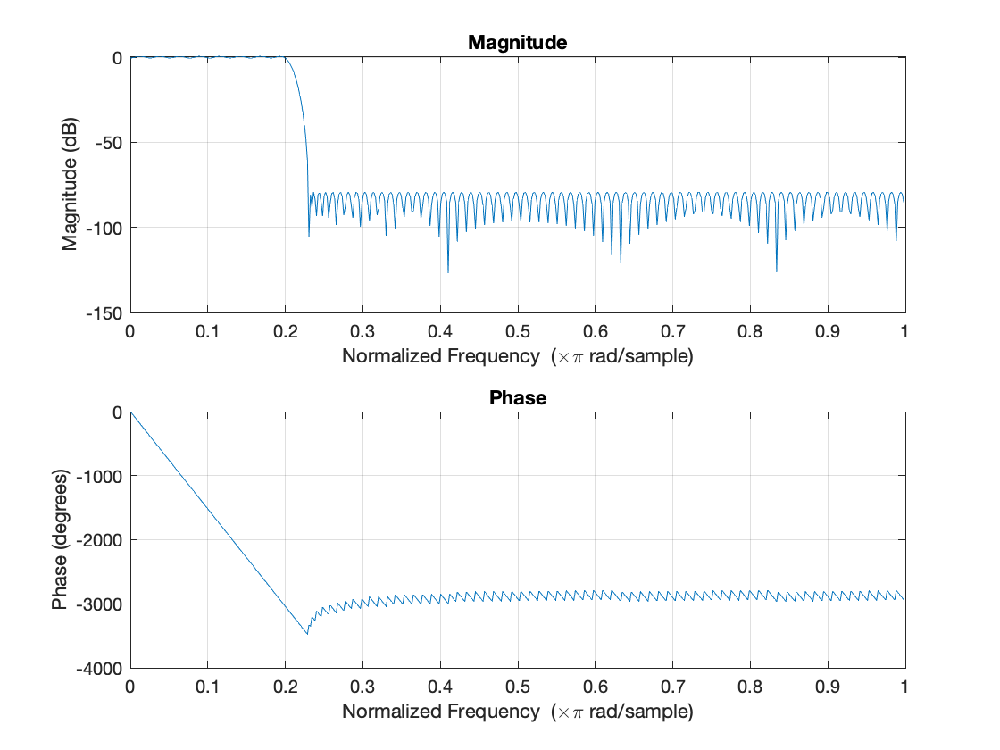
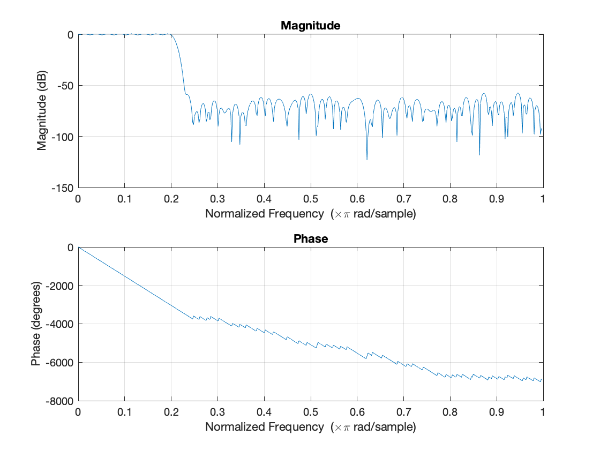
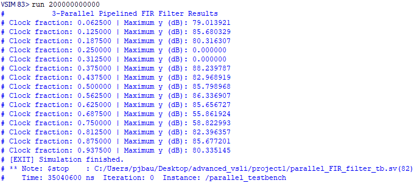
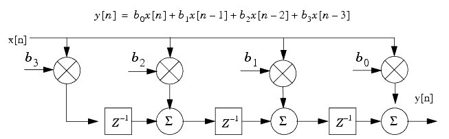
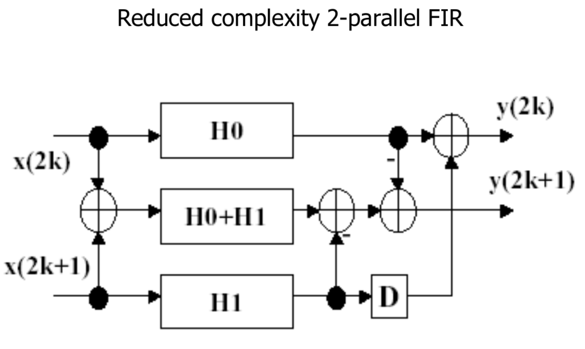
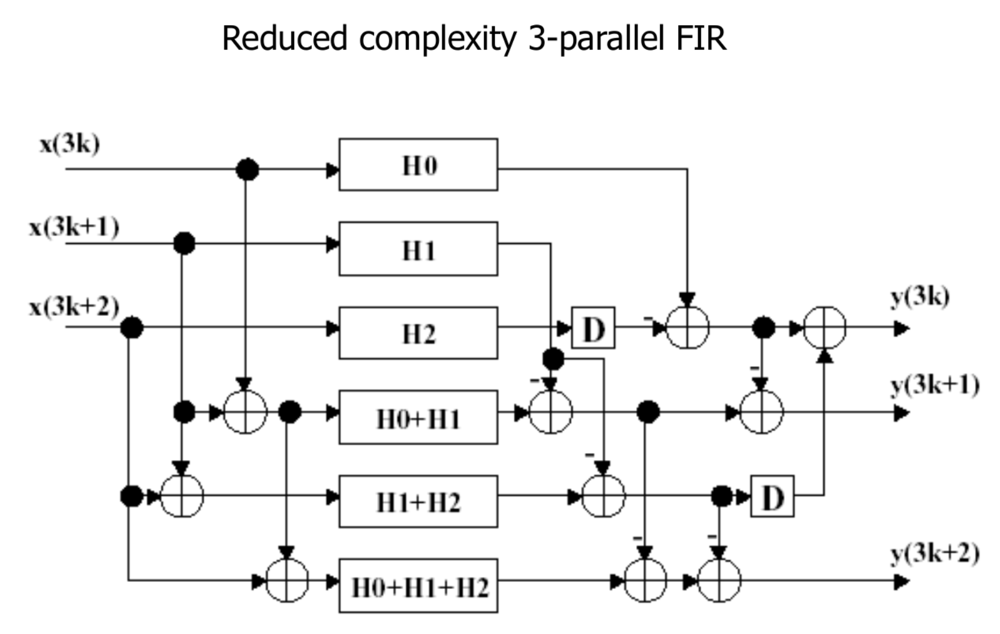

# FIR Filter Design
## 1 | Description of FIR Filter Design and SystemVerilog Code Structure
<!-- Description of the use of Matlab for FIR filter design and the structure of your Verilog code -->

Four different FIR filters have been designed in an effort to compare architectures and performance.
1. Pipelined FIR Filter
2. Reduced-Complexity Parallel (L=2) FIR Filter
3. Reduced-Complexity Parallel (L=3) FIR Filter 
4. Combined Pipelined and Parallel (L=3) FIR Filter

The specifications for this project are as follows:
1. Low pass filter with a cutoff frequency of 0.2 π rad/sample, ending at 0.23 π rad/sample
2. 100 taps (or more) (essentially create an N-tap filter)
2. Stopband attenuation of at least 80 dB

Each of the four designs should fulfill these criteria. This project was completed in SystemVerilog. It was compiled, tested, and analyzed using Intel Quartus Prime and ModelSim 2020.1.

### Matlab Design
Utilizing MATLAB's filter designer, the three specifications above were used to automatically generate the filter coefficients. Inputting the stopband and the transition band resulted in a minimum number of taps being 169. To extract the coefficients, another Matlab function was written to generate a SystemVerilog file, which will be included as a parameter for the filters. Before saving the coefficients, they had to be quantized and converted from a floating point number to a fixed point number. Then it could be converted to a binary number, and saved as an entry in the "filter_coeffs" array.

The Matlab code used to generate this file, named "print_filter_coefficients.m", and the frequency response image in section 2, can be found in the "MATLAB" directory. Also located in there is the ".fda" file which can be opened using Matlab's filter desinger.

To run the coefficient generator, run the "MATLAB_designed_filter.m" file, and it will output the file to the specified directory.

### Pipelined Code Structure
The code structure can be broken down into two categories, with the first being pipelined code. Each component has been placed in its own file and in its own module. The toplevel module for the pipelined case is the pipelined FIR filter itself. It does not declare any submodules. It only interacts with the "pipelined_FIR_filter_tb.sv" which is the testbench file. 

Both the pipelined and parallel modules share the "filter_coefficients.sv" file generated by the Matlab program, and the "parameters.sv" file. The latter essentially stores the number of taps; it was created in case any other shared parameters were to be global instead of local.

### Parallel Code Structure
The parallel FIR filters each follow their respective reduced-complexity data-flow graph (DFG). They can be found in the figures in section 3 below. Each of the 3 different parallel filter cases use the same testbench and follow the same code structure. The toplevel file will declare any subfilters. These subfilters are their own module and can be either pipelined or unpipelined. 

## 2 | Filter Frequency Response
<!-- Filter frequency response of the original (un-quantized) filter and quantized filter, comments/thoughts about the quantization effect, and anything you did to deal with overflow -->

*Figure 1: Unquantized frequency response for FIR filter*

The figure above shows the unquantized frequency response generated by the Matlab program. The below image shows the quantized frequency response of the expected output of each FIR filter. From both images, it is clear that the region from 0.2-0.23 π rad/sample, which is a normalized frequency, has a large drop in magnitude. It is an 80 dB drop as specified in the project guidelines.


*Figure 2: Quantized frequency response for FIR filter*

The image below shows the results of one of the tests. Each of the image results can be found in the "images" directory under their respective name with the word "_results" attached. Interestingly, the filter below did achieve a 80 dB drop around the 0.2-0.3 π rad/sample range, which is shown by the "clock fraction". However, there is some error that caused it to return back to the amplitude of around 80 dB, making the output seem more like a bandstop filter instead of a low-pass filter. This is an area for future investigation.



*Figure 3: 3-parallel pipelined FIR results*

### Overflow
A few measures were taken to deal with overflow. Firstly, the number of output bits was modified. If there are not enough bits in the output, then data will be lost, and the resulting magnitude could be incorrect. The number of bits for the output was designed to be 32. This is a result of the equation log_2(2^16 * 2^16) = 32. With 32 bits, the output should be accurate. 

Additionally, before each addition, the MSB was used to extend each operand. This can be seen in the following line where x[0] and x[1] are summed with the sign extension. 

```assign H0_H1_sum = {x[0][INP_WIDTH-1],x[0]}+{x[1][INP_WIDTH-1],x[1]};```

## 3 | Architecture of Each Filter 
<!-- Architecture of your pipelined and/or parallelized FIR filter -->

Each of the filters have an input signal x and an output signal y. Through the FIR filter, the goal is to remove the higher relative frequency signals.

Each of the designs share a few core design princples. Firstly, each design uses parameters to get static variables from either a parent module or another file. Shared parameters makes modifying tests much easier, and allows for faster iteration and bug fixing. Next, each file follows the same structure allowing it to be easily read. Lastly, each module was designed so that it is easily compatible with one another. 

### Pipelined FIR Filter


*Figure 4: Pipelined FIR filter DFG*

*Source: Al Qadi, Ziad. (2020). Evaluation of speech signal features extraction methods.*

Starting with the pipelined FIR filter, the design is straight forward. Given that each input x must be delayed by 1 stage before reaching the next tap. Therefore, each clock cycle, each item in the pipeline register array is set to the sum of the previous stage, plus the input "x" times the current filter coeffecient. An accumulator is used to get the last output, and summed with the next output. This design is shown in the above figure. 

### Reduced Complexity 2-Parallel FIR Filter


*Figure 5: Reduced complexity parallel (L=2) FIR filter DFG*

*Source: T. Zhang, Class Lecture, Topic: "Part 4: VLSI Architecture Design Methodologies --- Strength Reduction", ECSE 6680, Rensselaer Polytechnic Institute, Troy NY, Feb. 2024.*

Following the above reduced complixity design the parallel filter can be synthesized easily. This was derived using strength reduction, and is implemented using a series of subfilters. It takes advantage of the multiple filters and reduced logic to have two parallel inputs and two parallel outputs. 

The first input x(2k) is referred to as x[0] in code. It is transformed using the filter and is output from the H0 filter. For the first output y(2k), also referred to as y[0], it is calculated by adding this H0 filter output to the H1 delayed output. The delayed output is sythesized by only updating the operand with the H1 value every clock cycle. 

### Reduced Complexity 3-Parallel FIR Filter


*Figure 6: Reduced complexity parallel (L=3) FIR filter DFG*

*Source: T. Zhang, Class Lecture, Topic: "Part 4: VLSI Architecture Design Methodologies --- Strength Reduction", ECSE 6680, Rensselaer Polytechnic Institute, Troy NY, Feb. 2024.*

Using strength reduction, the above 3-parallel FIR filter achieves the desired output with an extra level of parallelism compared to the previous design. In the code, a few intermediate signals are calculated so more redundant calculations can be saved. 

This filter specifically uses 6 non-pipelined subfilters, each of which have their own specific input and output. For example, H0 and H1 each map to x[0] and x[1] respectively. Carefully following the DFG, each output is generated and the outputs are assigned. 

Taking the bottom subfilter for instance, the input is the sum of each of the three inputs, which is later fed to the y[2] output.

### Reduced Complexity 3-Parallel Pipelined FIR Filter
This FIR filter has the same design as the previous, with the exception that the FIR filter components used are pipelined instead of unpipelined.

### Testbench Design
The testbench design is a critical component of this project; without it, the output cannot be understood and the filter cannot be verified. All of the testbenches used share the same few core design ideas. 

All of the parameters are imported, including a few only used by the testbench. Once the device under test (DUT) is declared, then the main test will begin. For each input, a sinusoidal signal is generated. This signal is based on the fraction of the frequency, as mentioned in the project specifications. Once the input signal is generated, the simulation waits for all the taps to finish propagating. Then, the maximum magnitude is checked from the output y. This is then converted to a decibel according to the following equation.

```mag_dB = real'(20) * $log10($itor(max_y) * SCALE_FACTOR);```

This equation multiplies the maximum y value by a scale factor to reduce it, then converts the real, or float, to a deicbel quantity. From there, it can be analyzed whether or not the filter was able to achieve the amplitude drop of 80 dB around the 0.2 π rad/sample region. This can then be verified manually by seeing whether or not the magnitude displays the "low pass filter" behavior. 

## 4 | Hardware Implementation Results 
<!-- Detailed hardware implementation results (e.g., area, clock frequency, power estimation) -->

To analyze the performance of each design, a few metrics below are recorded using Intel Quartus Prime and the Quartus Prime Power Analyzer Tool. To perform each test, a new project had to be created, synthesized, placed and routed, and timed. The critical path in this case will be the worse-case setup slack.

| FIR Filter Type | Total Registers Used | Worst-Case Setup Slack (Critical Path) (ns) | Worst-Case Hold Slack (ns) | Worst-Case Minumum Pulse Width Slack (ns) | Power Consumed (mW) |
|---|---|---|---|---|---|
|Pipelined (non-parallel)|5373|-3.457|0.371|-0.724|355.28|
|2-Parallel|8897|-48.758|0.225|-2.25|527.61|
|3-Parallel|9783|-31.843|0.256|-2.225|528.76|
|3-Parallel Pipelined|13457|-3.942|0.315|-0.724|357.96|

Taking a look at the power and total number of registers used, the last design is certainly the most efficient. Having a design that is pipelined reduces the critical path, allowing for a faster maximum clock frequency. Additionally, processing 3 inputs at a time allows for the data to be processed quicker. However, in the case of these testbenches, to keep them comparable, they were all simulated for the same amount of time. This is evident in the "result" images.

Overall, it makes sense for the number of registers used to increase as the complexity increases. Also, the setup slack being the highest for the parallel filters makes sense as it has the longest critical path. For the power consumed, they are similar and it is a bit tricky to compare because a different device had to be simulated for place and route to occur correctly.

## 5 | Future Work and Conclusion
<!-- Further analysis and conclusion -->

Each of the four designs were able to be synthesized, placed, and tested. After testing their performance with the testbench files, each FIR filter was then tested for power, slack, and resource usage. These successes, however, were not without failure. There are still some remaining bugs causing each FIR filter to incorrectly calculate the magnitude of the outputted signal. This could be due to a few errors including filter coefficients, overflow, or quantization errors. Future work would consist of fixing these bugs, resulting in more robust FIR filter designs. Another area for future work could be designing an L=n parallel filter generator. This project has demonstrated an understanding in pipelining and parallelism, as well as the full design and testing process of a complex component in SystemVerilog. 
